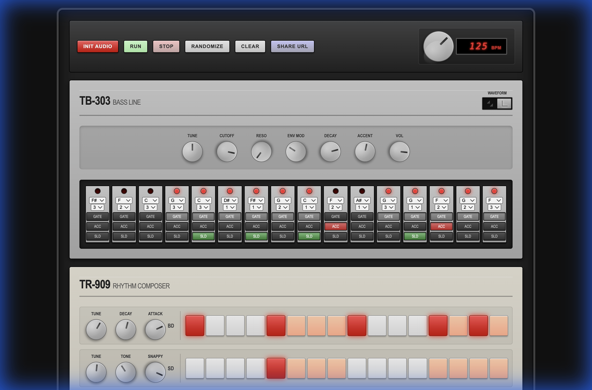

# acidBros - Web Audio Acid Studio

**acidBros** is a web-based synthesizer and sequencer inspired by the legendary Roland TB-303 Bass Line and TR-909 Rhythm Composer. It runs directly in your browser using the Web Audio API.

## Features

*   **TB-303 Emulation**:
    *   Sawtooth & Square waveforms.
    *   Classic controls: Tuning, Cutoff, Resonance, Envelope Modulation, Decay, Accent.
    *   16-step sequencer with Note, Octave, Slide, and Accent controls per step.
*   **TR-909 Emulation**:
    *   5 Drum Tracks: Bass Drum, Snare Drum, Closed Hat, Open Hat, Clap.
    *   Individual parameter controls for each drum sound (Tune, Decay, Snappy, etc.).
    *   16-step grid sequencer for each track.
*   **Global Controls**:
    *   Tempo control (BPM) with 7-segment LED display.
    *   Play, Stop, Clear, and Randomize functions.
    *   **Share URL**: Export your current pattern state to a URL to share with others.

## Usage

1.  **Start Audio**: Click the **INIT AUDIO** button to initialize the audio context (browser requirement).
2.  **Create a Pattern**:
    *   **TB-303**: Click steps on the 303 grid to activate notes. Adjust the knobs to shape the sound. Use the dropdowns to change notes and octaves. Toggle 'ACC' (Accent) and 'SLD' (Slide) for expressive sequences.
    *   **TR-909**: Click steps on the drum tracks to create a beat. Tweak the knobs for each drum sound.
3.  **Playback**: Press **RUN** to start the sequencer and **STOP** to pause.
4.  **Randomize**: Click **RANDOMIZE** to generate a fresh random pattern and sound patch.
5.  **Share**: Click **SHARE URL** to copy a link to your clipboard that contains your current pattern data.

## Installation

Simply open `index.html` in a modern web browser (Chrome, Firefox, Safari, Edge). No server or installation required.

## License

MIT License
