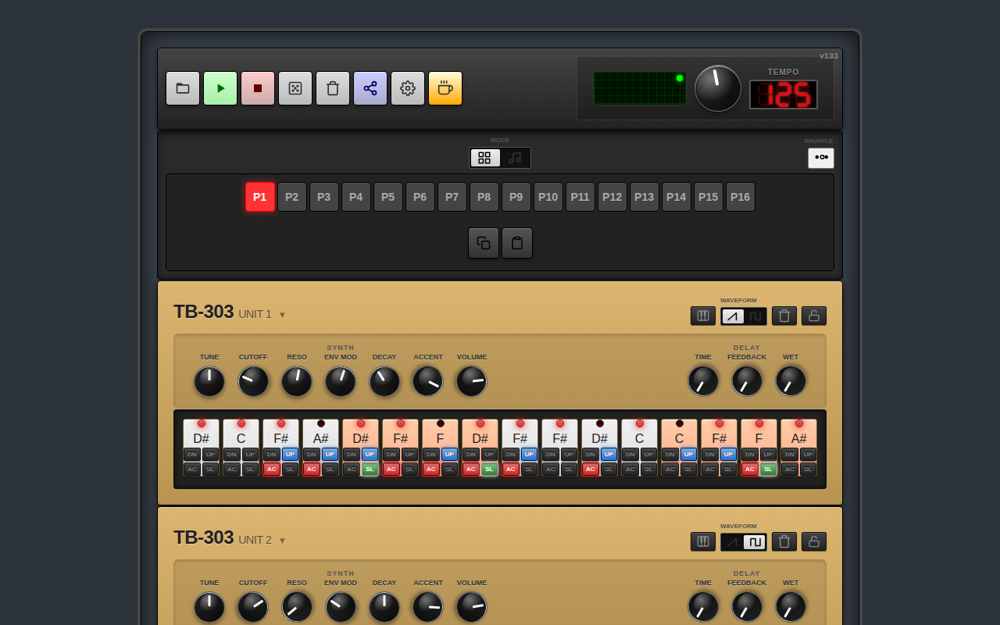
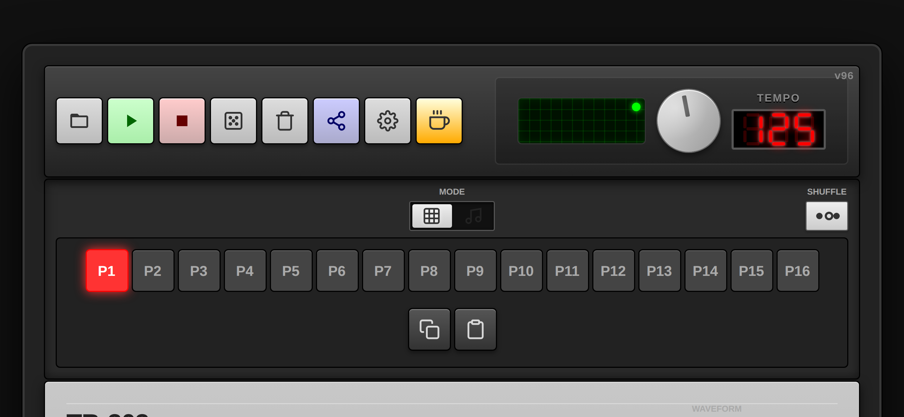
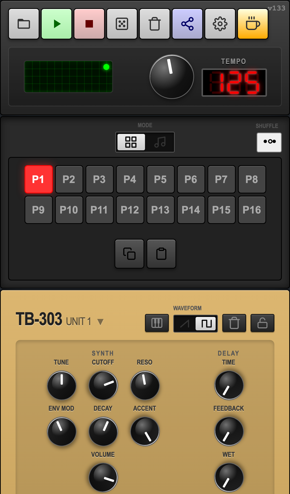

# acidBros - Web Audio Acid Studio

**acidBros** is a web‑based synthesizer and sequencer inspired by the legendary Roland TB‑303 Bass Line and TR‑909 Rhythm Composer. It runs directly in your browser using the Web Audio API.

🎹 **[Try it live!](https://acidsound.github.io/acidBros/)**

☕ **[Buy me a coffee](https://www.buymeacoffee.com/spectricki)** if you enjoy this project!

## Screenshots

### Desktop View


### Mobile Views
| Landscape | Portrait |
|:---:|:---:|
|  |  |

## UI/UX Overview
- **Design Language**: Dark glass‑morphism theme with neon accent colors, modern Google Fonts (Inter) and subtle micro‑animations for button presses, knob turns, and step activation.
- **Transport Bar**: Top bar with RUN, STOP, RANDOMIZE, CLEAR, SHARE URL, and Buy Me a Coffee buttons. Includes a large BPM knob with a 7‑segment LED display.
- **Oscilloscope**: Real-time green CRT-style waveform visualization located in the tempo section.
- **Mode Switch**: Animated toggle between Pattern Mode and Song Mode with smooth transition effects.
- **Pattern Mode**: Row of 16 pattern selectors (P1‑P16) with icon-based COPY and PASTE buttons for quick pattern management. Clicking a selector instantly switches the active pattern.
- **Song Mode**: Pattern selectors integrated into the song timeline, allowing multi‑pattern arrangements by tapping a selector. Timeline wraps onto multiple rows, eliminating horizontal scrolling.
- **Sequencer Grid**: 16‑step grid for each TB‑303 unit and each TR‑909 drum track. Steps light up with vibrant colors; slide/accent indicators animate with a pulse.
- **Knob Controls**: Glass‑like circular knobs with reflection; vertical drag changes values, rotation animation provides feedback. Double‑tap resets to default.
- **Toast Notifications**: Visual feedback for copy, paste, and share actions.
- **Responsive Design**: Adaptive layout for desktop, tablet, and mobile (portrait/landscape), preserving usability on touch devices.
- **Micro‑Animations**: Hover effects, button depressions, knob rotations, and step activation pulses create a premium, lively feel.

## Features

* **Dual TB‑303 Emulation**:
  * Two independent TB‑303 units for complex basslines and counter‑melodies.
  * Sawtooth & Square waveforms with animated toggle switch.
  * Classic controls: Tuning, Cutoff, Resonance, Envelope Modulation, Decay, Accent, Volume.
  * Tempo-synced Delay effect with Time and Feedback controls.
  * 16‑step sequencer with Note, Octave, Slide (SL) and Accent (AC) per step.
  * Piano Roll Note Selection: intuitive pop‑over keyboard with step navigation.
  * Monophonic Logic: authentic slide and gate behavior.
* **TR‑909 Emulation**:
  * Five drum tracks: Bass Drum, Snare Drum, Closed Hat, Open Hat, Clap.
  * Individual parameter controls and Level knobs for each drum sound.
  * 16‑step grid sequencer for each track.
  * Clear/Randomize toggle button for quick drum pattern creation.
* **Pattern & Song Modes**:
  * **Pattern Mode**: 16 independent patterns (P1-P16) with copy/paste functionality.
  * **Song Mode**: Arrange patterns into songs by clicking pattern buttons to add them to the timeline.
  * Smooth animated mode switching.
* **Live Performance Features**:
  * **Collapsible Sequencers**: Click machine headers to hide grids and focus on knobs for live tweaking.
  * **Swing/Shuffle Control**: Adjustable groove timing (0-100%) with visual ribbon controller and center reference line.
  * **File Manager**: Save, load, duplicate, rename, and delete patterns with persistent browser storage.
  * **Real-time Oscilloscope**: Visual feedback of the audio output.
  * **Touch Optimized**: Multi-touch support for knobs and responsive layout.
  * **MIDI Learn**: Map MIDI controllers to any knob, button, or toggle (including Transport & Waveform) for hands-on control.
  * **Keyboard Mapping**: Use PC or Bluetooth keyboards as an alternative to MIDI controllers.
  * **Settings Panel**: Dedicated interface for managing MIDI devices and mappings with easy learn mode.
* **Responsive Design**: Optimized for Desktop, Tablet, Mobile (Portrait/Landscape).
* **Global Controls**:
  * Tempo (BPM) with 7‑segment LED display (60-200 BPM).
  * Swing/Shuffle (💃) with collapsible ribbon controller (double-click/tap to reset to 50%).
  * File Manager (📁) for saving and managing multiple patterns/songs.
  * Settings (⚙️) for MIDI and keyboard mapping configuration.
  * Play, Stop, Clear, Randomize.
  * Share URL to export current pattern state.
* **PWA Support**: Installable as a Progressive Web App for offline use.
* **[User Manual](USER_MANUAL.md)**: Comprehensive guide.

## Usage

1. **Playback**: Press **RUN** to start the sequencer, **STOP** to pause.
2. **Select Mode**: Toggle between **Pattern Mode** and **Song Mode** using the animated MODE switch.
3. **Create a Pattern**:
   * **TB‑303 (Unit 1 & 2)**: Click steps to activate notes, adjust knobs, change notes/octaves via piano roll, toggle AC (Accent) and SL (Slide).
   * **TR‑909**: Click steps on drum tracks, tweak knobs and levels.
4. **Pattern Management**:
   * Select patterns using P1-P16 buttons.
   * Use icon-based COPY and PASTE buttons to duplicate patterns.
5. **Song Mode**:
   * Click pattern buttons to add them to the song timeline.
   * Click timeline blocks to remove them.
6. **Randomize**: Click **RANDOMIZE** for a fresh pattern and sound patch.
7. **Share**: Click **SHARE URL** to copy a link with the current pattern data.

## Installation

Open `index.html` in any modern browser (Chrome, Firefox, Safari, Edge). No server required.

For local development:
```bash
python3 -m http.server 8080
```
Then open `http://localhost:8080` in your browser.

## Architecture & How it Works

Curious about how the TB-303 and TR-909 synthesis engines are implemented in the Web Audio API?
Check out our detailed **[Synthesis Architecture Guide](SYNTH_ARCHITECTURE.md)** to see the signal flow diagrams and learn about the inner workings of the acid machine.

## License

MIT License
