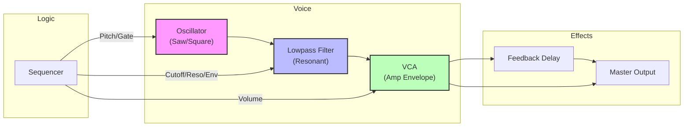
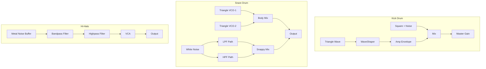
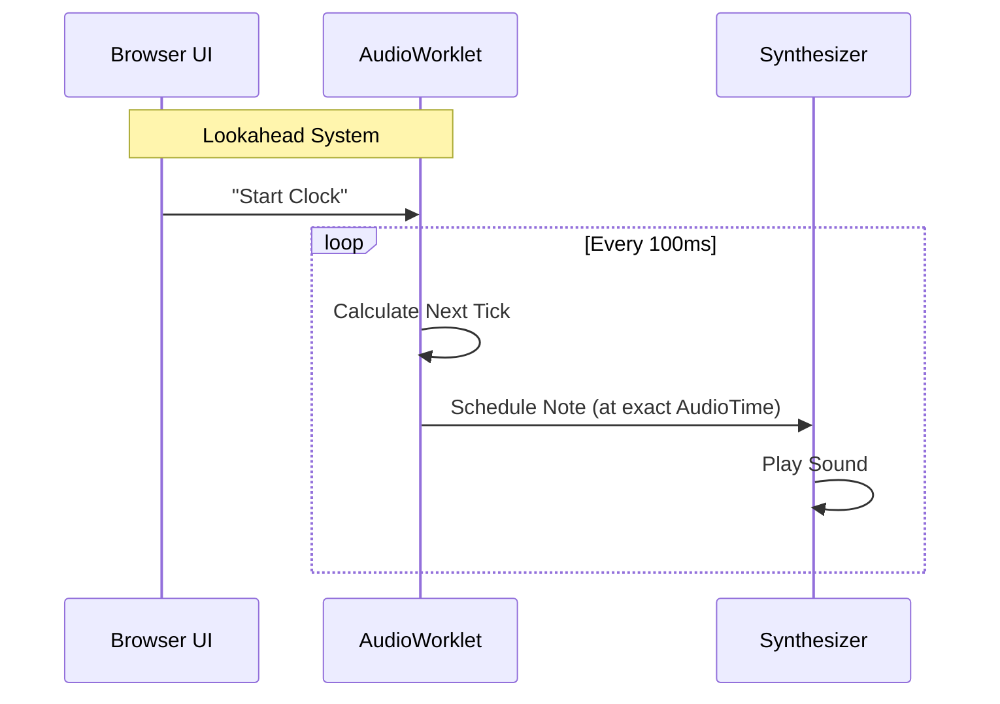

# 🎹 AcidBros Synthesis Architecture

Welcome to the engine room! 🔧
This document explains how the **TB-303** and **TR-909** are emulated in AcidBros using the Web Audio API. Whether you're a synth nerd or a curious developer, this guide will show you the signal flow behind the acid.

---

## 1. TB-303 Bassline Generator

The TB-303 is a subtractive monophonic synthesizer. Its character comes from the interaction between the **Oscillator**, the **Filter**, and the **Accent/Slide** logic.

### Signal Flow



### Key Concepts

#### 🌊 The Oscillator
We use a standard Web Audio `OscillatorNode`.
- **Sawtooth**: Rich in harmonics, the classic "buzzy" acid sound.
- **Square**: Hollow and woody, great for deep basslines.

#### 🎛️ The Filter (The Heart of Acid)
The filter is a **4-pole Lowpass Filter** (emulated via BiquadFilter).
- **Cutoff**: Removes high frequencies.
- **Resonance**: Boosts the frequencies around the cutoff point. In AcidBros, the resonance range is extended to scream!
- **Envelope Modulation**: The "Env Mod" knob controls how much the envelope moves the cutoff frequency up and down for each note.

#### 🚀 Slide (Legato)
When **Slide** is active on a step:
1. The Oscillator **does not stop**.
2. The frequency **glides** (ramps) to the next note's pitch.
3. The Filter and Volume envelopes **do not retrigger**, creating a smooth, morphing sound.

#### 💥 Accent
When **Accent** is active:
1. **Volume**: Boosted.
2. **Filter Cutoff**: Opens wider.
3. **Filter Decay**: Becomes shorter and punchier (the "wow" becomes a "whip").

---

## 2. TR-909 Rhythm Composer

The TR-909 is a hybrid beast. It uses **Analog Synthesis** for drums like Kick and Snare, and **Samples** (digital recordings) for Cymbals and Hi-Hats. AcidBros emulates the analog parts using code!

### Drum Architecture



---

### 🥁 Bass Drum (Kick) - Deep Dive

AcidBros의 909 킥은 순수 신디사이저 방식으로 구현됩니다.

#### Signal Chain
```
Triangle Oscillator → WaveShaper (Saturation) → Amp Envelope → Master Gain
                                                      ↑
Square Click Osc + Bandpass Noise ─────────────────────→
```

#### Parameters & Behavior

| Knob | Parameter | Hardware Ref | Implementation |
|------|-----------|--------------|----------------|
| **LEVEL** | `P.vol` | Master Volume | Master Gain Node에 직접 적용 (`P.vol * 1.5`) |
| **TUNE** | `P.p1` | VR2 (Pitch Env Decay) | 피치 스윕의 **감쇠 시간** 조절 (아래 참조) |
| **ATTACK** | `P.p2` | VR3 (Click Level) | 클릭 컴포넌트의 볼륨 (`0.4` 곱셈) |
| **DECAY** | `P.p3` | VR4 (Amp Decay) | 메인 바디의 감쇠 시간 (`0.1s ~ 0.9s`) |

#### TUNE 동작 (P.p1) - 핵심 로직

**현재 동작**: TUNE 노브는 **피치 스윕의 감쇠 시간**을 조절합니다.

```javascript
// 40이 "중립점" - 타이트한 쿵
if (P.p1 <= 40) {
    pitchDecay = 0.005 + (P.p1 / 40) * 0.015; // 5ms ~ 20ms (Very tight)
} else {
    pitchDecay = 0.02 + ((P.p1 - 40) / 60) * 0.150; // 20ms ~ 170ms
}
```

- **TUNE 0-40**: 매우 빠른 피치 스윕 (사실상 스윕 없는 "쿵")
- **TUNE 40**: 중립 - 클래식한 909 킥 사운드
- **TUNE 40-100**: 점점 긴 피치 스윕 ("뮤~" 사운드)

#### 고정 값들 (Hardcoded)
| 항목 | 값 | 비고 |
|------|-----|------|
| Base Frequency | 48 Hz | 하드웨어 분석 기반 |
| Start Pitch | 48 × 6 = 288 Hz | 피치 스윕 시작점 |
| Oscillator Type | Triangle | 사인보다 풍부한 고조파 |
| Saturation Amount | 10 | WaveShaper 시그모이드 커브 |
| Click Osc Frequency | 800 Hz | Square wave |
| Click Duration | 5-8ms | 매우 짧은 트랜지언트 |
| Noise Filter | Bandpass @ 2500 Hz | 클릭의 노이즈 컴포넌트 |

#### 🔧 튜닝 포인트 (조정 가능한 부분)

1. **Base Frequency (48Hz)**: 더 깊은 킥을 원하면 45Hz, 펀치감을 원하면 52Hz
2. **Start Pitch Ratio (×6)**: 더 강한 "어택감"을 원하면 ×8, 부드러운 킥을 원하면 ×4
3. **WaveShaper Amount (10)**: 더 많은 새츄레이션을 원하면 20-30, 클린하면 5
4. **Click Level Multiplier (0.4)**: 클릭이 약하면 0.6, 강하면 0.2

---

### 🐍 Snare Drum - Deep Dive

909 스네어는 두 개의 삼각파 VCO와 병렬 필터링된 노이즈의 조합입니다.

#### Signal Chain
```
VCO-1 (Triangle) ─┬→ Body Gain → Output
VCO-2 (Triangle) ─┘
                         20ms Pitch Bend ↗

White Noise → LPF (4-8kHz) → LPF Gain ─┬→ Output
          └→ HPF (1.2-3.2kHz) → HPF Gain ─┘
```

#### Parameters & Behavior

| Knob | Parameter | Hardware Ref | Implementation |
|------|-----------|--------------|----------------|
| **LEVEL** | `P.vol` | Master Volume | Body와 Snappy 모두에 적용 |
| **TUNE** | `P.p1` | VR1 (VCO Pitch) | 베이스 주파수 조절 (`180Hz ~ 240Hz`) |
| **TONE** | `P.p2` | VR2 (Filter Cutoff) | 듀얼 필터의 컷오프 주파수 |
| **SNAPPY** | `P.p3` | VR10 (Snappy Level) | 노이즈 컴포넌트의 볼륨 |

#### Dual VCO Structure (서비스 노트 기반)

```javascript
const f1 = baseFreq;              // 180-240 Hz
const f2 = baseFreq * 1.62;       // 1:1.62 비율 (하드웨어 분석)

// 20ms Pitch Bend (IC36)
const bendDepth = 1.5;
osc1.frequency.setValueAtTime(f1 * bendDepth, now);
osc1.frequency.exponentialRampToValueAtTime(f1, now + 0.02);
```

#### Snappy Parallel Filter Paths

| Path | Filter | Frequency Range | 역할 |
|------|--------|-----------------|------|
| LPF (IC39b) | Lowpass | 4000 + (TONE × 4000) Hz | "두툼한" 스냅 |
| HPF (IC39a) | Highpass | 1200 + (TONE × 2000) Hz | "치직거리는" 고역 |

---

### 기타 드럼 요약

#### 👏 Hand Clap (CP)
- **노이즈** → **Bandpass (1200Hz)** → **Burst Envelope (4× 8ms)**
- `P.decay`: 테일 지속 시간

#### 🥁 Toms (LT/MT/HT)
- **3개의 VCO** (Triangle + 2× Sine)
- 주파수 비율: LT(80/120/160), MT(120/180/240), HT(180/270/360)
- VCO-3에 스킨 노이즈 추가

#### 🔔 Rim Shot
- **3개의 사인파** (220, 500, 1000 Hz) + **Triangle Snap** (1800→400Hz)
- Bridged-T 네트워크 시뮬레이션

---

## 3. Timing & Sequencing

How does it stay in time?



AcidBros uses an **AudioWorklet** (or a fallback scheduler) to look ahead into the future. It tells the Web Audio API: *"Hey, in exactly 0.523 seconds, play a C# note."*
This ensures rock-solid timing even if the graphics lag or the browser is busy.

---

### Happy Tweaking! 🎛️
Now that you know how it works, go make some noise!
