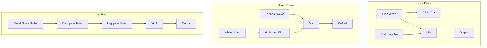
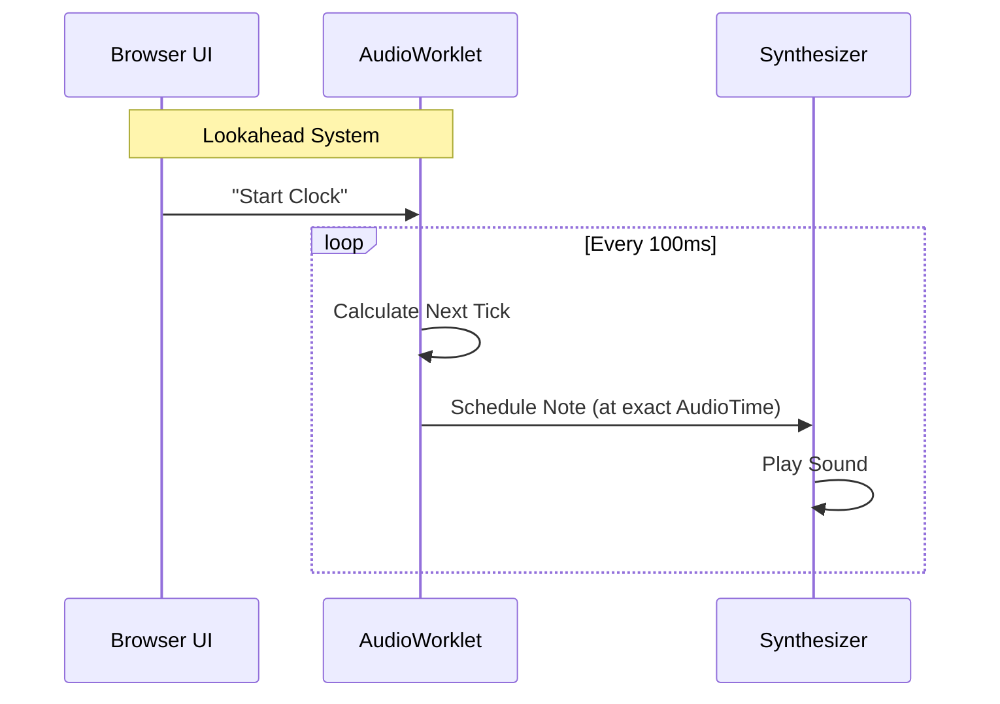

# 🎹 AcidBros Synthesis Architecture

Welcome to the engine room! 🔧
This document explains how the **TB-303** and **TR-909** are emulated in AcidBros using the Web Audio API. Whether you're a synth nerd or a curious developer, this guide will show you the signal flow behind the acid.

---

## 1. TB-303 Bassline Generator

The TB-303 is a subtractive monophonic synthesizer. Its character comes from the interaction between the **Oscillator**, the **Filter**, and the **Accent/Slide** logic.

### Signal Flow

```mermaid
graph LR
    subgraph Voice
    OSC[Oscillator<br/>(Saw/Square)] --> FILTER[Lowpass Filter<br/>(Resonant)]
    FILTER --> VCA[VCA<br/>(Amp Envelope)]
    end
    
    subgraph Logic
    SEQ[Sequencer] -- Pitch/Gate --> OSC
    SEQ -- Cutoff/Reso/Env --> FILTER
    SEQ -- Volume --> VCA
    end

    subgraph Effects
    VCA --> DELAY[Feedback Delay]
    DELAY --> OUT[Master Output]
    VCA --> OUT
    end

    style OSC fill:#f9f,stroke:#333,stroke-width:2px
    style FILTER fill:#bbf,stroke:#333,stroke-width:2px
    style VCA fill:#bfb,stroke:#333,stroke-width:2px
```

### Key Concepts

#### 🌊 The Oscillator
We use a standard Web Audio `OscillatorNode`.
- **Sawtooth**: Rich in harmonics, the classic "buzzy" acid sound.
- **Square**: Hollow and woody, great for deep basslines.

#### 🎛️ The Filter (The Heart of Acid)
The filter is a **4-pole Lowpass Filter** (emulated via BiquadFilter).
- **Cutoff**: Removes high frequencies.
- **Resonance**: Boosts the frequencies around the cutoff point. In AcidBros, the resonance range is extended to scream!
- **Envelope Modulation**: The "Env Mod" knob controls how much the envelope moves the cutoff frequency up and down for each note.

#### 🚀 Slide (Legato)
When **Slide** is active on a step:
1. The Oscillator **does not stop**.
2. The frequency **glides** (ramps) to the next note's pitch.
3. The Filter and Volume envelopes **do not retrigger**, creating a smooth, morphing sound.

#### 💥 Accent
When **Accent** is active:
1. **Volume**: Boosted.
2. **Filter Cutoff**: Opens wider.
3. **Filter Decay**: Becomes shorter and punchier (the "wow" becomes a "whip").

---

## 2. TR-909 Rhythm Composer

The TR-909 is a hybrid beast. It uses **Analog Synthesis** for drums like Kick and Snare, and **Samples** (digital recordings) for Cymbals and Hi-Hats. AcidBros emulates the analog parts using code!

### Drum Architecture



### Deep Dive

#### 🥁 Bass Drum (Kick)
It's not a sample! It's pure math.
- **Body**: A Sine wave that sweeps quickly from a high frequency (~150Hz) down to a low frequency (~50Hz). This creates the "thump".
- **Attack**: A tiny "Click" impulse is added at the start to help the kick cut through the mix.

#### 🐍 Snare Drum
A mixture of two elements:
1. **Tone**: A Triangle wave sweeping down (the "body" of the drum).
2. **Snappy**: White noise passed through a filter (the "wires" under the snare).

#### 👏 Hand Clap
The Clap is unique. It's generated by shaping noise with a special "sawtooth" envelope that triggers **multiple times** in milliseconds (simulating a group of people clapping slightly out of sync), followed by a reverb-like decay tail.

---

## 3. Timing & Sequencing

How does it stay in time?



AcidBros uses an **AudioWorklet** (or a fallback scheduler) to look ahead into the future. It tells the Web Audio API: *"Hey, in exactly 0.523 seconds, play a C# note."*
This ensures rock-solid timing even if the graphics lag or the browser is busy.

---

### Happy Tweaking! 🎛️
Now that you know how it works, go make some noise!
