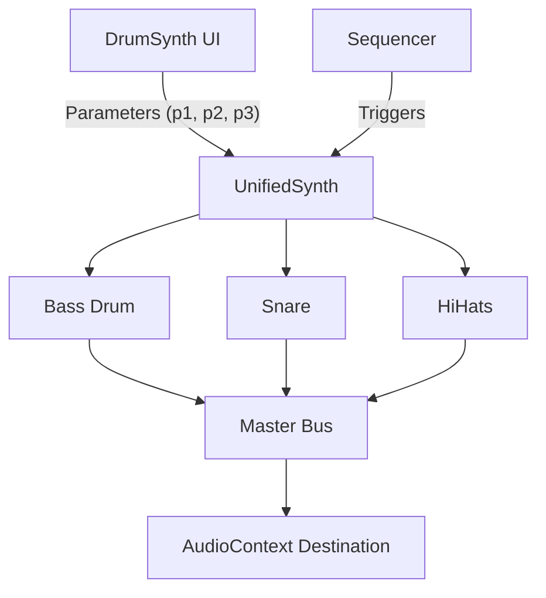
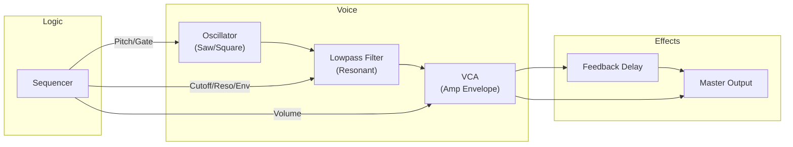

# 🎹 AcidBros Synthesis Architecture (v1.2)

Welcome to the engine room! 🔧
This document explains the core synthesis architecture of AcidBros, including the **TB-303 Emulation**, **TR-909 Drum Synthesis**, and the new **Unified Drum Engine**.

---

## 1. Unified Drum Engine (New)

AcidBros now powers its drum sounds using the `UnifiedSynth` engine, a modular architecture designed to faithfully recreate the analog characteristics of the TR-909.

### Key Components
- **DrumVoice**: Base class for all drum modules. Handles parameter smoothing (`setParamTarget`), volume envelopes, and live knob inputs.
- **SynthVoices**: Collection of specialized voice implementations (`BassDrumVoice`, `SnareDrumVoice`, `HiHatVoice`, etc.) in `js/audio/tr909/`.
- **AudioEngine**: Manages the Web Audio Context and master mixing.

### Signal Flow


### Parameter Mapping system
The engine uses a standardized parameter system to map UI controls to synthesis variables:
- **Knobs (p1, p2, p3)**: Mapped to specific voice parameters (e.g., Tune, Decay, Snappy).
- **Global toggle**: `enabled` state for muting/unmuting voices.
- **Micro-toggles**: Specific to voices (e.g., `Osc 1 On/Off`, `Noise On/Off`).

---

## 2. Drum Synth Editor (UI)

The **Drum Synth Editor** provides a deep-dive interface for sound design, modeled after the TR-909's internal trimmers and front-panel controls.

### Features
- **Channel Strip Layout**: Horizontal scrolling modules for every drum voice.
- **TR-909 Style Controls**: Custom rotary knobs with 909 styling (grey body, orange pointer) and toggle switches.
- **Live Preview**: Adjust parameters in real-time while the sequencer runs or via the preview button.
- **Preset Management**: Load and save custom drum patches per track.
- **Compact Param Selectors**: Inline radio buttons for Waveform (`Tri`/`Sin`/`Sqr`) and Filter Type.

### Control Types
1.  **Rotary Knobs**: 
    -   `LEVEL`: Master volume for the voice.
    -   `TUNE`, `ATTACK`, `DECAY`, `TONE`, `SNAPPY`: Synthesis parameters mapped to `p1`, `p2`, `p3`.
2.  **Switches**:
    -   `Auto-Trig`: Automatically triggers the sound when parameters change.
    -   `Voice Enable`: Toggle individual oscillators or noise layers.

---

## 3. TR-909 Rhythm Composer (Models)

The TR-909 is a hybrid beast. It uses **Analog Synthesis** for drums like Kick and Snare, and **Samples** (digital recordings) for Cymbals and Hi-Hats. AcidBros emulates the analog parts using code!

### 🥁 Bass Drum (Kick) - Deep Dive

AcidBros의 909 킥은 순수 신디사이저 방식으로 구현됩니다.

#### Signal Chain
```
Triangle Oscillator → WaveShaper (Saturation) → Amp Envelope → Master Gain
                                                      ↑
Square Click Osc + Bandpass Noise ─────────────────────→
```

#### Parameters & Behavior

| Knob | Parameter | Implementation |
|------|-----------|----------------|
| **LEVEL** | `P.vol` | Master Gain Node (`P.vol * 1.5`) |
| **TUNE** | `P.p1` | Pitch Sweep Decay Time (5ms ~ 170ms) |
| **ATTACK** | `P.p2` | Click Component Level |
| **DECAY** | `P.p3` | Main Body Amp Decay (0.1s ~ 0.9s) |

---

### 🐍 Snare Drum - Deep Dive

909 스네어는 두 개의 삼각파 VCO와 병렬 필터링된 노이즈의 조합입니다.

#### Signal Chain
```
VCO-1 (Triangle) ─┬→ Body Gain → Output
VCO-2 (Triangle) ─┘
                         20ms Pitch Bend ↗

White Noise → LPF (4-8kHz) → LPF Gain ─┬→ Output
          └→ HPF (1.2-3.2kHz) → HPF Gain ─┘
```

#### Parameters & Behavior

| Knob | Parameter | Implementation |
|------|-----------|----------------|
| **LEVEL** | `P.vol` | Master Volume |
| **TUNE** | `P.p1` | Base Frequency (`180Hz ~ 240Hz`) |
| **TONE** | `P.p2` | Filter Cutoff for both LPF/HPF paths |
| **SNAPPY** | `P.p3` | Noise Component Volume |

---

### 👏 Hand Clap (CP)
- **Signal**: Noise → Bandpass (1200Hz) → Burst Envelope (Sawtooth repeat 4x).
- **Reverb**: Simulated internal reverb circuit filter.
- **Controls**: Speed (Repeat rate), Decay (Tail length).

### 🔔 Rim Shot (RS)
- **Signal**: 3 cascaded Oscillators (bridged-T simulation) + Triangle Snap.
- **Snap**: Adds a short, high-pitched decay envelope for the metallic "clack".

### 🥁 Toms (LT/MT/HT)
- **Signal**: 3 VCOs (Triangle + 2x Sine) per Tom.
- **Noise**: Skin noise added to VCO-3.

---

## 4. TB-303 Bassline Generator

The TB-303 is a subtractive monophonic synthesizer. Its character comes from the interaction between the **Oscillator**, the **Filter**, and the **Accent/Slide** logic.

### Signal Flow


### Key Concepts
- **Oscillator**: Sawtooth (Buzzy) / Square (Hollow).
- **Filter**: 4-pole Lowpass with Resonance and Envelope Modulation.
- **Accent**: Boosts volume and opens filter cutoff, shortens decay.
- **Slide**: Glides pitch and suppresses envelope re-trigger.

---

## 5. Timing & Sequencing

AcidBros uses an **AudioWorklet** (or a fallback scheduler) to look ahead into the future. It tells the Web Audio API: *"Hey, in exactly 0.523 seconds, play a C# note."*
This ensures rock-solid timing even if the graphics lag or the browser is busy.

---

### Happy Tweaking! 🎛️
Now that you know how it works, go make some noise!
