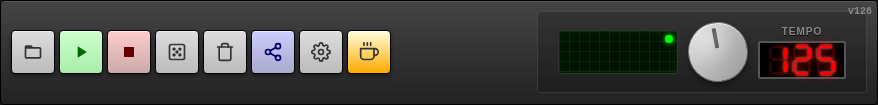
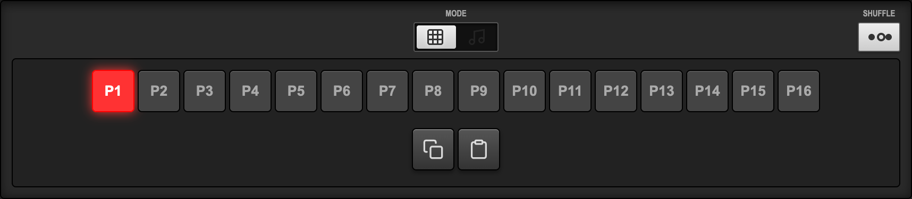
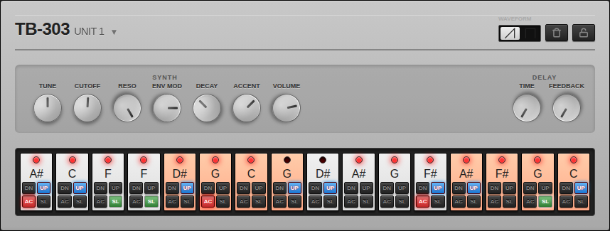
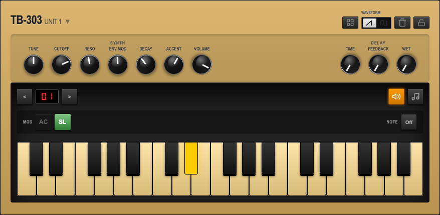
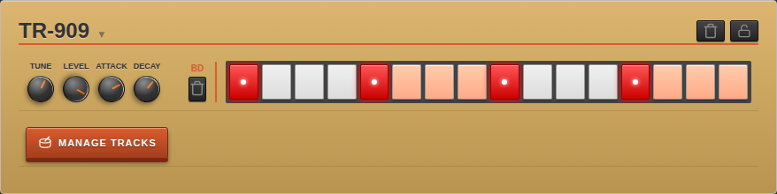
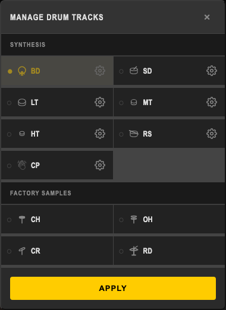
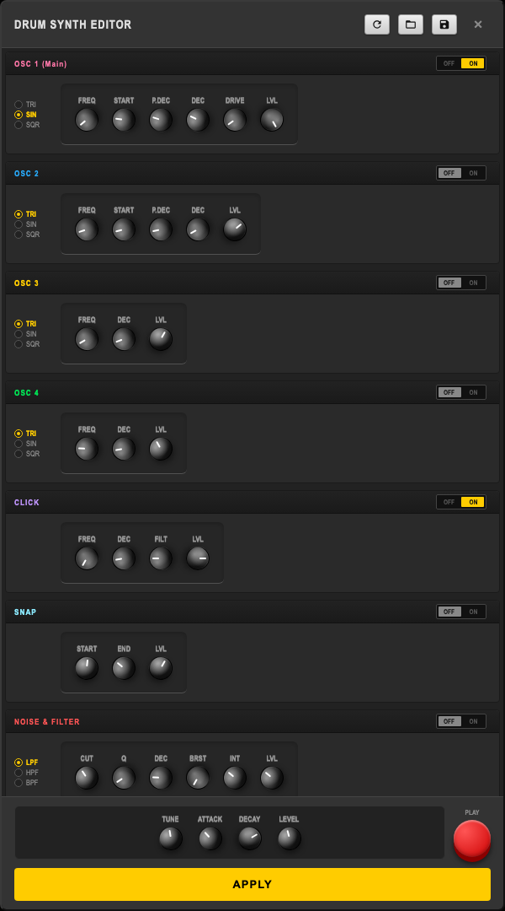
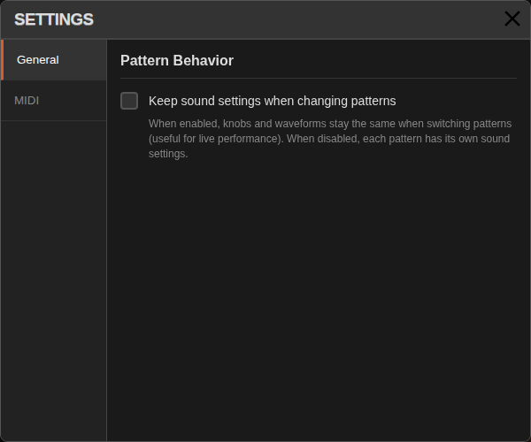

# AcidBros User Manual 🎹

Welcome to **AcidBros**, your web‑based acid techno studio! This manual guides you through the interface and helps you start making beats instantly.

---

## 1. Transport & Global Controls
The top bar provides the main playback and project controls.



- **FILE MANAGER (📁)** – Save, load, and manage multiple patterns/songs with persistent browser storage. Click to open the file manager popover.
  - **New** – Create a new file (clears current pattern).
  - **Import/Export** – Import or export all files as JSON for backup.
  - **Delete All** – Remove all saved files.
  - **File List** – Click a file to load it. Each file shows:
    - **Duplicate** – Create a copy of the file.
    - **Rename** – Change the file name.
    - **Delete** – Remove the file.
  - Files are auto-saved every 5 seconds with timestamp-based names.
- **RUN / STOP** – Start or pause the sequencer.
- **RANDOMIZE (🎲)** – Generate a fresh random pattern and sound patch for all units. **Note:** Units with a locked randomization (🔒) will not be changed.
- **CLEAR** – Reset all patterns (303 notes and 909 drums) to a blank state.
- **SHARE URL** – Export the current pattern and settings as a shareable link. A toast notification confirms the link is copied.
- **SETTINGS (⚙️)** – Configure MIDI and keyboard mappings for hands-on control. Click to open the settings panel with MIDI mapping management interface.
- **SUPPORT (☕️)** – Buy me a coffee. Support the development of AcidBros.
- **Oscilloscope** – Real-time visual feedback of the audio waveform.
  - **Power Toggle**: Click the oscilloscope display to turn it ON or OFF. 
  - **Performance**: Turning it OFF significantly reduces CPU/GPU usage, which is recommended for low-power mobile devices.
  - **Visual Indicator**: A small green LED lights up when active. The display dims when deactivated.
- **TEMPO (BPM)** – Large knob with a 7‑segment LED display (60-200 BPM). Drag vertically to adjust, double‑tap to reset to 125 BPM.

---

## 2. Mode Switch & Pattern Management


### Mode Switch
Toggle between **Pattern Mode** and **Song Mode** using the animated switch. The handle slides smoothly between modes.

### Pattern Mode
- **Pattern Selectors (P1-P16)** – Click to switch between 16 independent patterns.
- **COPY Button** (📋 icon) – Copy the current pattern. Toast notification confirms "Pattern copied!"
- **PASTE Button** (📄 icon) – Paste the copied pattern. Toast notification confirms "Pattern pasted!"



### Song Mode
- **Pattern Timeline** – Click pattern buttons (P1-P16) to add them to your song arrangement.
- **Timeline Blocks** – Click a block to **remove** it. **Drag and drop** blocks to reorder them in the timeline.
- **Multi-Row Grid Layout** – Timeline uses a consistent 8/16 column grid to match the pattern selectors, eliminating horizontal scrolling.

### SWING/SHUFFLE
- **Toggle** – Click the shuffle button to open the swing control panel.
- **Adjust Timing** – Control groove timing from 0% (straight) to 100% (maximum shuffle). 50% is the default straight timing.
- **Reset Timing** – Double-click/tap the ribbon controller to reset to 50% timing.

---

## 3. TB‑303 Bassline Units
AcidBros features **two independent TB‑303 units** (Unit 1 & 2). Each unit offers classic acid‑style synthesis.



### Machine Header
- **UNIT TITLE** – Click the title to collapse/expand the unit.
- **WAVEFORM** – Toggle between Sawtooth and Square waveforms.
- **CLEAR (🗑️)** – Reset the sequence for this unit.
- **LOCK (🔒)** – Toggle randomization lock. When active (orange), this unit will be skipped when clicking the global **RANDOMIZE** button.

### Sound Controls (Knobs & Switches)

#### SYNTH Section
- **WAVEFORM** – Animated toggle between Sawtooth and Square waveforms.
- **TUNE** – Fine‑tune the pitch (-1200 to +1200 cents).
- **CUTOFF** – Filter brightness control (0-100%).
- **RESO** – Resonance/squelch character (0-15).
- **ENV MOD** – Envelope modulation amount on the filter (0-100%).
- **DECAY** – Note tail length (0-100%).
- **ACCENT** – Boost level for accented steps (0-100%).
- **VOLUME** – Output level (0-100%, default 60%).

#### DELAY Section
- **TIME** – Delay time as percentage of tempo (0-200%, tempo-synced).
- **FEEDBACK** – Delay feedback amount (0-100%).
- **WET** – Delay wet/dry mix amount (0-100%).

*Double‑tap any knob to reset to its default value.*

### Sequencer Grid
Each unit has a 16‑step grid. Steps light up when active.

#### Step Controls
- **LED** – Lights up red when step is active.
- **Note Display** – Shows current note (e.g., "C"). Click to open piano roll.
- **DN/UP Buttons** – Quick octave down/up (octave 1-3, default 2).
- **AC Button** – Toggle accent (red when active).
- **SL Button** – Toggle slide (green when active).

### Inline Piano Roll



Click the piano toggle button (🎹) in the TB-303 unit header to open the advanced inline note editor:

- **Step Navigation (< >)** – Move between steps with wrap-around.
- **Step Indicator** – Shows current step number (01-16).
- **View Toggle (🎹/⬛)** – Switch between the piano keyboard layout and the step layout.
- **Piano Keys / Steps** – Click to select pitch (C to B with sharps/flats).
- **Octave Controls (DN/UP)** – Select octave (1, 2, or 3).
- **Modifiers**:
  - **AC** – Accent toggle (red when active).
  - **SL** – Slide toggle (green when active).
- **Preview (🔊)** – Toggle to hear notes before committing.
- **GATE OFF (REST)** – Mute the step while keeping note value.
- **Close** – Close the editor by clicking the piano toggle button again.

*Pressing a piano key automatically advances to the next step for fast pattern entry.*

---

## 4. TR‑909 Rhythm Composer
The drum section provides classic 909 sounds.



### Drum Tracks
Each track has dedicated parameter knobs and a level control:

- **BASS DRUM (BD)** – Kick with Tune, Level, Attack, Decay.
- **SNARE DRUM (SD)** – Snare with Tune, Level, Tone, Snappy.
- **LOW TOM (LT) / MID TOM (MT) / HIGH TOM (HT)** – Pitch-sweeping toms with Tune, Level, Decay.
- **RIM SHOT (RS)** – Percussive rim sound with Level control.
- **HAND CLAP (CP)** – Classic 909 clap with Level control.
- **CLOSED HAT (CH)** – Short hat with Level, Decay, Tune.
- **OPEN HAT (OH)** – Long hat with Level, Decay.
- **CRASH (CR)** – Crash cymbal with Level, Tune.
- **RIDE (RD)** – Ride cymbal with Level, Tune.

### Manage Drum Tracks



Click the **MANAGE TRACKS** button at the bottom of the TR-909 unit to open the Manage Drum Tracks popover.
- **Toggle Tracks**: Enable or disable specific drum tracks to customize your 909 layout.
- **Edit Drum Synth**: Click the **Settings icon** (⚙️) next to any synthesis-based track (BD, SD, LT, MT, HT, RS, CP) to open the Drum Synth Editor.
- **Apply**: Click **APPLY** to save your track layout.

### Sequencer Grid
Each track has its own 16‑step grid. Active steps glow orange/yellow; inactive steps remain dark.

### Machine Header Actions
- **CLEAR (🗑️)** – The 909 section has a dedicated clear/randomize toggle:
  - **Empty patterns** → Click to randomize all drum tracks.
  - **Filled patterns** → Click to clear all drum tracks.
- **LOCK (🔒)** – Toggle randomization lock. When active (orange), the 909 will be skipped when clicking the global **RANDOMIZE** button.

### Advanced Drum Editor (Drum Synth Editor)



Click the **Settings icon** (⚙️) within the **MANAGE TRACKS** modal to open the full **Drum Synth Editor** for a specific track.

- **Deep Editing**: Modify internal parameters like 4 independent Oscillators (OSC 1-4), Click, Snap, and Noise/Filter modules to create unique drum sounds.
- **Presets**: Save and load your custom drum patches.
- **Classic Reset**: Instantly revert to the original factory TR-909 sound at any time.
- **Live Preview**: Hear changes immediately by clicking the Play / Preview button.
- **Live Track Knobs**: Tweak the track's main macro knobs (Tune, Level, Decay, etc.) while editing the deep synth parameters.

---

## 5. UI/UX Features

### Visual Feedback
- **Toast Notifications** – Appear at the bottom for copy, paste, and share actions.
- **Touch-Optimized Active States** – Buttons and knobs provide instant visual feedback on touch/click using `:active` states (glow/transform).
- **Active States** – Current pattern, playing step, and active controls are highlighted.
- **Smooth Animations** – Mode switch, button presses, and transitions are animated.
- **Oscilloscope** – Visualizes the master audio output in real-time.

### Live Performance Mode
- **Collapse/Expand** – Click the header of any machine (TB-303 or TR-909) to collapse its sequencer section.
- **Focus on Knobs** – This hides the grid and allows you to focus purely on sound manipulation (knobs) during a live performance.
- **Visual Indicator** – The arrow next to the machine title indicates the current state (▼ expanded, ◄ collapsed).

### Responsive Design
- **Desktop** – Full layout with all controls visible.
- **Tablet** – Optimized spacing and touch targets.
- **Mobile Portrait** – Stacked layout with sequencer grid adapting to 4 or 8 columns.
- **Mobile Landscape** – Horizontal layout optimized for wider screens.

### Common Interactions
- **Adjust Knobs** – Click (or touch) and drag vertically.
- **Reset Knobs** – Double‑tap to revert to default.
- **Toggle Buttons** – Single tap to activate/deactivate.
- **Prevent Zoom** – Mobile UI locks zoom to allow rapid tapping on sequencer steps.

---

## 6. Quick Start Guide

1. Press **RANDOMIZE** for a starting point.
2. Press **RUN** to hear the beat.
3. Switch to **Pattern Mode** if not already there.
4. Tweak **CUTOFF** and **RESONANCE** on the TB‑303 units while playing.
5. Click steps in the sequencer to create your own pattern.
6. Use **COPY** and **PASTE** to duplicate patterns across P1-P16.
7. Switch to **Song Mode** to arrange multiple patterns.
8. Click **SHARE URL** to copy a shareable link.

Happy Acid Making! 🚀

---

## 7. Advanced Tips

### TB-303 Tips
- Use **SLIDE** on consecutive notes for classic acid glide effects.
- Combine high **RESONANCE** with moderate **CUTOFF** for squelchy sounds.
- **ACCENT** adds punch to specific steps—use sparingly for impact.
- The **DELAY** effect is tempo-synced—try 50% for eighth-note delays or 100% for quarter-note delays.

### TR-909 Tips
- Layer **BD** and **SD** on different steps for classic house patterns.
- Use **CH** and **OH** together, but avoid triggering both on the same step (909 behavior).
- The **CLAP** sounds great on beats 2 and 4 for a classic backbeat.

### Pattern Management
- Create variations by copying a pattern and making small changes.
- Use different patterns for verse, chorus, and breakdown sections.
- In Song Mode, repeat patterns to create longer arrangements.

### 💡 Quick Tip: Import Patterns from Shared URLs

You can import patterns directly from shared URLs without manually navigating to them:

1. **Copy a shared URL** – When someone shares an AcidBros URL with you (e.g., `https://acidbros.app/#XXXX...`), simply copy the entire URL.
2. **Select target pattern** – In AcidBros, select the pattern slot (P1-P16) where you want to import the pattern.
3. **Paste** – Click the **PASTE** button (📄 icon).
4. **Done!** – The pattern and **its sound settings** (Knobs, Waveforms) from the shared URL will be imported into your selected pattern slot.

The paste function automatically detects if your clipboard contains an AcidBros share URL and extracts the pattern data from it. If the clipboard doesn't contain a valid URL, it will paste from the internal clipboard as usual.

*Note: This feature requires clipboard access permission in your browser.*

### 🎼 Advanced: Sharing Complete Songs with Multiple Patterns

When you want to share a complete song that uses multiple patterns (e.g., a song arrangement using P1, P3, P5, and P8), follow this workflow:

#### For the Creator (Sharing)

1. **Switch to Song Mode** – Make sure your song arrangement is set up in the timeline.
2. **Share the Song URL** – Click **SHARE URL** to copy the song structure and knob settings.
3. **Share each pattern separately**:
   - Switch to **Pattern Mode**
   - Select **P1**, click **SHARE URL**, save/send this URL labeled as "Pattern 1"
   - Select **P3**, click **SHARE URL**, save/send this URL labeled as "Pattern 3"
   - Repeat for all patterns used in your song (P5, P8, etc.)

**Example sharing format:**
```
🎵 My Acid Track
- Song: https://acidbros.app/#ABC123...
- P1 (Intro): https://acidbros.app/#DEF456...
- P3 (Verse): https://acidbros.app/#GHI789...
- P5 (Chorus): https://acidbros.app/#JKL012...
- P8 (Breakdown): https://acidbros.app/#MNO345...
```

#### For the Receiver (Importing)

1. **Click the Song URL first** – This loads the song arrangement timeline and all synth/drum settings.
2. **Import patterns one by one**:
   - Copy the "Pattern 1" URL
   - Select **P1** in Pattern Mode
   - Click **PASTE** (📄) – The pattern is imported!
   - Repeat for P3, P5, P8, etc.
3. **Play your complete song** – Switch back to Song Mode and hit **RUN**!

*💡 Tip: The receiver only needs to import patterns that are actually used in the song. Check the song timeline to see which pattern slots are needed.*

### Performance Tips
- Adjust knobs in real-time while playing for live tweaking.
- Use the **RANDOMIZE** button for instant inspiration.
- The **CLEAR** button in Pattern Mode clears all units; in Song Mode it clears the timeline.

---

## 8. MIDI & Keyboard Mapping

AcidBros supports mapping MIDI controllers and PC/Bluetooth keyboards to any UI control for hands-on performance.

### Settings Panel

Click the **Settings (⚙️)** button in the transport bar to open the configuration panel.



The Settings panel provides:
- **General Tab** – Configure global application behaviors
  - **Keep sound settings when changing patterns**:
    - **Unchecked (Default)**: Each pattern loads its own unique sound settings (Knobs, Waveforms). This allows for drastic sound changes between patterns.
    - **Checked**: Sound settings are preserved when switching patterns. This behaves like a traditional hardware synth where knobs are global, which is useful for live performance consistency.
- **MIDI Tab** – Configure MIDI devices and mappings
  - **MIDI Devices** – View connected MIDI input devices and their status
  - **MIDI Mappings** – View and manage all active mappings
- **Refresh Devices** – Scan for newly connected MIDI devices
- **Clear All Mappings** – Remove all current mappings
- **Close (×)** – Close the settings panel

### MIDI Devices

The **MIDI Devices** section displays a list of all connected MIDI input devices.
- **Status Indicator**: Green dot for connected, Red for disconnected.
- **Device Info**: Shows device name, manufacturer, and connection state.
- **Refresh**: Click the refresh button to scan for new devices if they don't appear automatically.

### MIDI Learn Mode

Map any MIDI controller to a UI control:

1. Open the **Settings** panel
2. Click the **MIDI** tab
3. Click **Learn** next to any control in the mappings list, OR
4. Click **MIDI Learn** on any knob/button in the main UI
5. Move/press the desired MIDI control (knob, fader, button, or pad)
6. The mapping is created instantly

**Supported MIDI Messages:**
- **Note On** – For buttons, toggles, and piano keys
- **Control Change (CC)** – For knobs and continuous controls
- **All MIDI Channels** – Channel information is stored per mapping

**Mappable Controls:**
- **Knobs**: All synthesis and drum parameters, Tempo (MIDI CC only, not keyboard)
- **Buttons**: Pattern selectors (P1-P16), Transport (Play/Stop)
- **Waveform Toggle**: Single key/note toggles between Saw↔Square for each unit

### Keyboard Mapping

Use your PC or Bluetooth keyboard for transport controls and pattern selection:

1. Open the **Settings** panel
2. Click **Learn** next to a control
3. Press the desired keyboard key
4. The key is mapped to that control

**Note:** Keyboard mappings work best for buttons and toggles. Knobs require MIDI CC for continuous control.

### Managing Mappings

The Settings panel displays all active mappings with:
- **Target Control** – Name and ID of the mapped UI element
- **Source** – MIDI (with channel and note/CC number) or Keyboard (with key code)
- **Type** – Knob, Button, Toggle, Waveform-Toggle, or Key
- **Delete (×)** – Remove individual mapping

### Mapping Types

- **Knobs** – MIDI CC values (0-127) are automatically scaled to the knob's range
- **Buttons** – Triggered on Note On or CC > 63 (MIDI) or key press (Keyboard)
- **Toggles** – Note On toggles state; CC 0-63 = Off, 64-127 = On
- **Waveform Toggle** – Note On or key press toggles between Sawtooth and Square
- **Piano Keys** – Note On/Off for playing notes in the piano roll editor

### Tips

- **One mapping per control** – Creating a new mapping for a control removes the old one
- **MIDI channel aware** – Different channels can control different parameters
- **Persistent mappings** – Mappings are saved with your project files
- **Visual feedback** – Controls show a "learning" state while waiting for input

---

## 9. Keyboard Shortcuts

Currently, keyboard shortcuts are available through the keyboard mapping system (see section 8). Map any key to any control for custom shortcuts.

---

## 10. Browser Compatibility

AcidBros works best in modern browsers:
- ✅ Chrome/Edge (recommended)
- ✅ Firefox
- ✅ Safari (desktop and iOS)

*Note: Some older browsers may not support all Web Audio API features.*

---

## 11. Installation

### Local Development
You can run AcidBros locally using either Python or Node.js:

**Using Python:**
```bash
python3 -m http.server 8080
```
Then open `http://localhost:8080` in your browser.

**Using Node.js:**
```bash
npx serve .
```
Then open `http://localhost:5000` in your browser.

### Progressive Web App (PWA)
On supported browsers, you can install AcidBros as a standalone app:
1. Click the install icon in your browser's address bar.
2. Follow the prompts to add to your home screen or applications.
3. Launch AcidBros like a native app with offline support.

---

## License
MIT License
