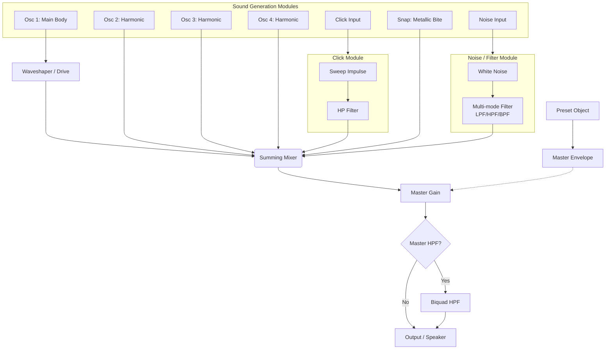
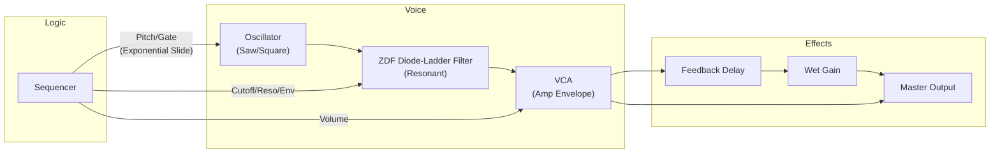

# 🎹 AcidBros Synthesis Architecture (v1.2)

Welcome to the engine room! 🔧
This document explains the core synthesis architecture of AcidBros, including the **TB-303 Emulation**, **TR-909 Drum Synthesis**, and the new **Unified Drum Engine**.

---

## 1. Unified Drum Engine (UnifiedSynth)

The `UnifiedSynth` is a versatile, multi-component drum synthesizer. Instead of separate classes for each drum, a single engine dynamically assembles the sound based on a **Preset Object**.

### Internal Block Diagram

### Component Details

#### 1. Main Oscillator (`osc1`)
The primary body of the sound (e.g., the "Boom" of a kick).
- **Envelopes**: Pitch (exponential sweep) and Amplitude (Linear attack + Exponential decay).
- **Saturation**: Includes an optional `WaveShaper` node for analog-style drive.
- **Modes**: Support for `staticLevel` (level controlled by Master Env).

#### 2. Additional Oscillators (`osc2`, `osc3`, `osc4`)
Used for harmonic richness (e.g., the tonal body of a snare or different frequencies in a Tom).
- Supports frequency sweeps and individual decay envelopes or `staticLevel` mode.

#### 3. Click Component
Adds a sharp percussive transient pulse, specifically for BD attack.
- **Internal Structure**: A high-frequency sine wave swept down extremely fast (impulse simulation) passed through a High-Pass filter.

#### 4. Snap Component
Recreates the metallic "clack" for sounds like Rim Shot.
- **Structure**: A Triangle wave with an extremely fast downward frequency sweep and a very short linear amplitude decay.

#### 5. Noise / Filter Module (`noise`, `noise2`)
White noise generators coupled with a dedicated filter section.
- **Filter**: Dedicated Biquad filter supporting LPF, HPF, or BPF modes. 
- **Burst Mode**: Supports multi-hit bursts (Clap style) with configurable count and intervals.

#### 6. Output & Master Filter
- **Master Gain**: Unified amplitude control for all mixed modules.
- **Master HPF**: A global high-pass filter used to clean up low-end mud in specific sounds (like Rim Shot).

### Parameter Reference (Preset Object)

| Module | Key Parameters |
| :--- | :--- |
| `osc1-4` | `freq`, `startFreq`, `p_decay`, `a_decay`, `level`, `wave`, `staticLevel`, `drive` (osc1 only) |
| `click` | `startFreq`, `freq`, `decay`, `filter_freq`, `level` |
| `snap` | `startFreq`, `endFreq`, `level` |
| `noise` | `cutoff`, `Q`, `decay`, `level`, `filter_type`, `burst_count`, `burst_interval` |
| `master` | `masterEnv` {level, decay}, `masterHPF` (Hz) |

---

---

## 2. Drum Synth Editor (UI)

The **Drum Synth Editor** provides a deep-dive interface for sound design, modeled after the TR-909's internal trimmers and front-panel controls.

### Features
- **Channel Strip Layout**: Horizontal scrolling modules for every drum voice.
- **TR-909 Style Controls**: Custom rotary knobs with 909 styling (grey body, orange pointer) and toggle switches.
- **Live Preview**: Adjust parameters in real-time while the sequencer runs or via the preview button.
- **Preset Management**: Load and save custom drum patches per track.
- **Compact Param Selectors**: Inline radio buttons for Waveform (`Tri`/`Sin`/`Sqr`) and Filter Type.

### Control Types
1.  **Rotary Knobs**: 
    -   `LEVEL`: Master volume for the voice.
    -   `TUNE`, `ATTACK`, `DECAY`, `TONE`, `SNAPPY`: Synthesis parameters mapped to `p1`, `p2`, `p3`.
2.  **Switches**:
    -   `Auto-Trig`: Automatically triggers the sound when parameters change.
    -   `Voice Enable`: Toggle individual oscillators or noise layers.

---

## 3. TR-909 Rhythm Composer (Models)

The TR-909 is a hybrid instrument. It uses **Analog Synthesis** (emulated via `UnifiedSynth`) for drums like Kick and Snare, and **Samples** (digital recordings) for Cymbals and Hi-Hats.

---

### 🥁 Bass Drum (Kick)
The kick is generated entirely by synthesis, modeled accurately after the analog schematic. It uses a sine-shaped core with a subtle asymmetric drive and a high-pass filtered transient pulse for the attack, recreating the authentic 909 punch.

| Panel Knob | Target UnifiedSynth Parameter | Description |
| :--- | :--- | :--- |
| **TUNE** | `osc1.freq` & `osc1.p_decay` | Changes the fundamental base pitch (40Hz-65Hz) and the speed of the downward pitch sweep (5ms-170ms). |
| **ATTACK** | `click.level` | Adjusts the volume of the internal Click module (a sharp, High-Pass filtered transient pulse). |
| **DECAY** | `osc1.a_decay` | Controls the exponential amplitude decay of the main body. Extended up to 2.0s for deep 808-style drops (Colin Fraser Mod). |

---

### 🐍 Snare Drum
The snare combines two tonal oscillators for the "body" and two filtered noise paths for the "snappy" wires.

| Panel Knob | Target UnifiedSynth Parameter | Description |
| :--- | :--- | :--- |
| **TUNE** | `osc1/2.freq` | Shifts the base frequency of the tonal body (180Hz to 240Hz). |
| **TONE** | `noise/2.cutoff` | Controls the frequency of the LPF and HPF noise paths. |
| **SNAPPY** | `noise/2.level` | Adjusts the mix balance of the snappy wire (noise) sound. |

---

### 👏 Hand Clap (CP)
Simulates the original's noise burst and reverb circuit.
- **Engine**: Noise module in **Burst Mode**.
- **Mechanism**: 4 rapid noise hits at 8ms intervals followed by a longer decay tail.
- **DECAY Mapping**: Mapped to `noise.decay` (0.2s to 0.8s), affecting the length of the final tail.

---

### 🔔 Rim Shot (RS)
Recreates the metallic "clack" using harmonic oscillators and a Master HPF.
- **Engine**: 3 Sine oscillators (`osc1, 2, 3`) with specific harmonic ratios.
- **Bite**: The `snap` module provides a sharp, high-pitched triangle sweep.
- **Master HPF**: Fixed at 200Hz to remove low-frequency ringing.

---

### 🥁 Toms (LT/MT/HT)
Toms use a shared architectural preset with varied base frequencies.
- **Logic**: Uses `masterEnv` for overall decay.
- **TUNE Mapping**: Shifts the frequency of all 3 oscillators (`osc1, 2, 3`) simultaneously.
- **DECAY Mapping**: Controls `masterEnv.decay`, which gates all internal oscillators.

---

### 💿 Sample-Based Instruments (CH, OH, CR, RD)
Hi-Hats and Cymbals use 6-bit 32kHz original samples, processed through a digital playback engine in `DrumVoice`.

#### 1. Hi-Hats (CH / OH)
- **Source**: `hh01.wav` (CH) and `oh01.wav` (OH).
- **Tuning**: The `TUNE` knob adjusts the `playbackRate` (0.8x to 1.2x).
- **Decay**: OH has a dedicated `DECAY` knob controlling the amplitude ramp duration. CH has a fixed short decay.
- **Choke**: Playing a CH immediately kills any ringing OH.

#### 2. Cymbals (CR / RD)
- **Source**: `cr01.wav` (Crash) and `rd01.wav` (Ride).
- **Tuning**: Mapped to `cr_tune` / `rd_tune` providing a wide frequency range (0.6x to 1.6x).
- **Duration**: Long legacy tails reaching up to 2.5 seconds.

---

## 4. TB-303 Bassline Generator

The TB-303 is a subtractive monophonic synthesizer. Its character comes from the interaction between the **Oscillator**, the **Filter**, and the **Accent/Slide** logic.

### Signal Flow

### Key Concepts
- **Oscillator**: Sawtooth (Buzzy) / Square (Hollow).
- **Filter**: Zero-Delay Feedback (ZDF) Diode-Ladder Filter (AudioWorklet). This replaces the standard 4-pole Lowpass for a much more authentic, "squelchy" resonance characteristic.
- **Accent**: Boosts volume, aggressively opens filter cutoff, shortens decay, and increases envelope modulation depth.
- **Slide**: Glides pitch exponentially (using `exponentialRampToValueAtTime`) for a natural, analog feel, and suppresses envelope re-trigger.

---

## 5. Timing & Sequencing

AcidBros uses an **AudioWorklet** (or a fallback scheduler) to look ahead into the future. It tells the Web Audio API: *"Hey, in exactly 0.523 seconds, play a C# note."*
This ensures rock-solid timing even if the graphics lag or the browser is busy.

---

### Happy Tweaking! 🎛️
Now that you know how it works, go make some noise!
